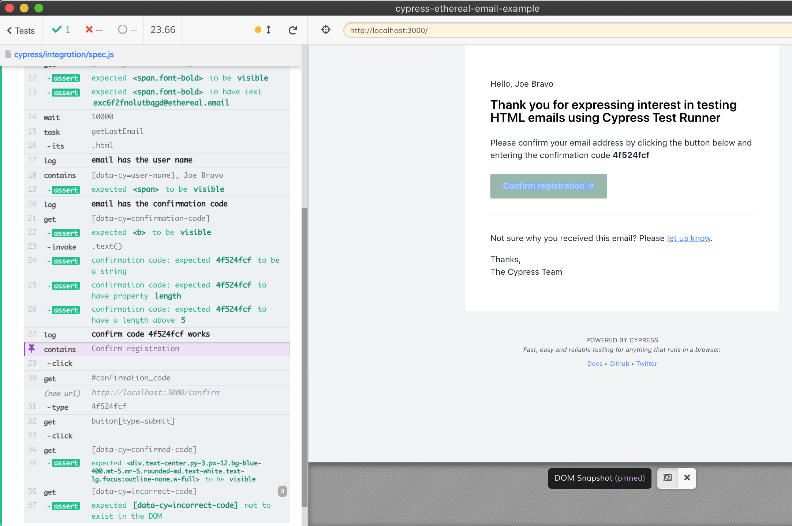
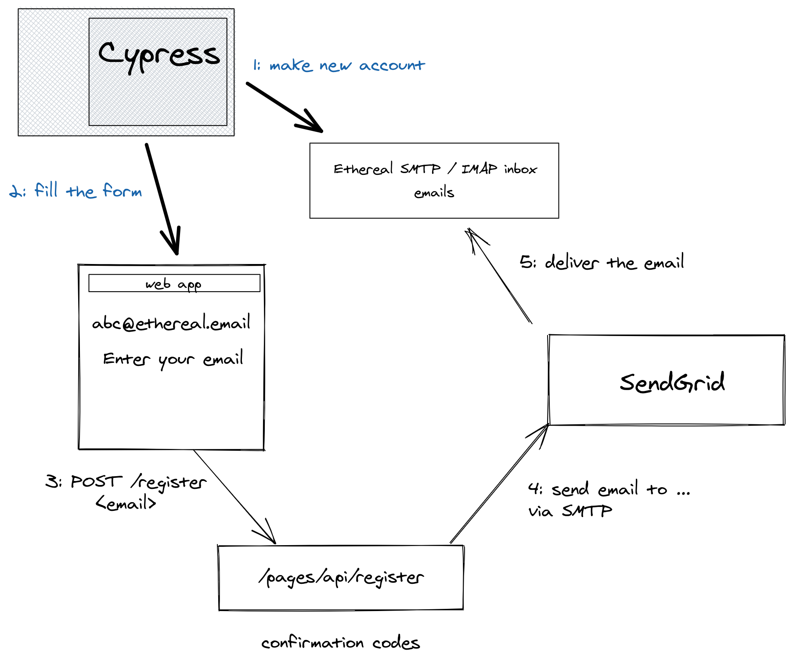
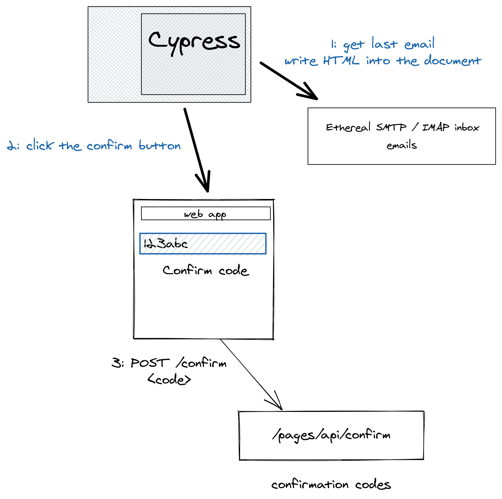

# cypress-ethereal-email-example

[![ci status][ci image]][ci url] [![badges status][badges image]][badges url] [![renovate-app badge][renovate-badge]][renovate-app]  [](https://dashboard.cypress.io/projects/v1m866/runs)

> Using an external [Ethereal email](https://ethereal.email/) inbox and [Sendgrid](https://sendgrid.com/) to test emails

Read the blog post ["Full Testing of HTML Emails using SendGrid and Ethereal Accounts"](https://www.cypress.io/blog/2021/05/24/full-testing-of-html-emails-using-ethereal-accounts/)



**Note:** if you are using an SMTP server directly to send emails, take a look at [cypress-email-example](https://github.com/bahmutov/cypress-email-example) repository where we spawn our own SMTP server right from the Cypress during tests.

## Install and run

This application uses Sendgrid to send emails, thus you need to configure an account and expose it via environment variables

```
SENDGRID_HOST=smtp.sendgrid.net
SENDGRID_PORT=465
SENDGRID_USER=
SENDGRID_PASSWORD=
# the same as verified sender
SENDGRID_FROM=
```

**Tip:** use [as-a](https://github.com/bahmutov/as-a) utility to inject a block of environment variables when running a command.

The above variables are only needed for the `npm start` process, as Cypress creates its own temporary email [Ethereal email inbox](https://ethereal.email/).

```shell
$ npm install
$ npm start
# from another terminal
$ npx cypress open
# click the spec.js
```

## Application

Next JS application showing the confirm page, emailing a confirmation code and storing it in the database. The API hook [pages/api/register.js](./pages/api/register.js) uses [src/emailer.js](./src/emailer.js) to send the email using the SMTP config from the environment variables.

Once the user gets the email, they enter the confirmation code that is checked against the database by [pages/api/confirm.js](./pages/api/confirm.js).

## The test

The temporary email account is created by [cypress/plugins/email-account.js](./cypress/plugins/email-account.js) code called from the [cypress/plugins/index.js](./cypress/plugins/index.js). The [cypress/integration/spec.js](./cypress/integration/spec.js) does the full end-to-end test:

- opens the application page
- enters the temporary email address
- checks the temporary email address to get the last email
- loads the HTML email in the Test Runner
- grabs the confirmation code and clicks the confirm button
- enters the extracted confirmation code
- verifies the page shows "Success"

The start of the test



The second part of the test



## Small print

Author: Gleb Bahmutov &lt;gleb.bahmutov@gmail.com&gt; &copy; 2021

- [@bahmutov](https://twitter.com/bahmutov)
- [glebbahmutov.com](https://glebbahmutov.com)
- [blog](https://glebbahmutov.com/blog)
- [videos](https://www.youtube.com/glebbahmutov)
- [presentations](https://slides.com/bahmutov)
- [cypress.tips](https://cypress.tips)
- [Cypress Advent 2021](https://cypresstips.substack.com/)

License: MIT - do anything with the code, but don't blame me if it does not work.

Support: if you find any problems with this module, email / tweet /
[open issue](https://github.com/bahmutov/cypress-ethereal-email-example/issues) on Github

## MIT License

Copyright (c) 2021 Gleb Bahmutov &lt;gleb.bahmutov@gmail.com&gt;

Permission is hereby granted, free of charge, to any person
obtaining a copy of this software and associated documentation
files (the "Software"), to deal in the Software without
restriction, including without limitation the rights to use,
copy, modify, merge, publish, distribute, sublicense, and/or sell
copies of the Software, and to permit persons to whom the
Software is furnished to do so, subject to the following
conditions:

The above copyright notice and this permission notice shall be
included in all copies or substantial portions of the Software.

THE SOFTWARE IS PROVIDED "AS IS", WITHOUT WARRANTY OF ANY KIND,
EXPRESS OR IMPLIED, INCLUDING BUT NOT LIMITED TO THE WARRANTIES
OF MERCHANTABILITY, FITNESS FOR A PARTICULAR PURPOSE AND
NONINFRINGEMENT. IN NO EVENT SHALL THE AUTHORS OR COPYRIGHT
HOLDERS BE LIABLE FOR ANY CLAIM, DAMAGES OR OTHER LIABILITY,
WHETHER IN AN ACTION OF CONTRACT, TORT OR OTHERWISE, ARISING
FROM, OUT OF OR IN CONNECTION WITH THE SOFTWARE OR THE USE OR
OTHER DEALINGS IN THE SOFTWARE.

[ci image]: https://github.com/bahmutov/cypress-ethereal-email-example/workflows/ci/badge.svg?branch=main
[ci url]: https://github.com/bahmutov/cypress-ethereal-email-example/actions
[badges image]: https://github.com/bahmutov/cypress-ethereal-email-example/workflows/badges/badge.svg?branch=main
[badges url]: https://github.com/bahmutov/cypress-ethereal-email-example/actions
[renovate-badge]: https://img.shields.io/badge/renovate-app-blue.svg
[renovate-app]: https://renovateapp.com/
